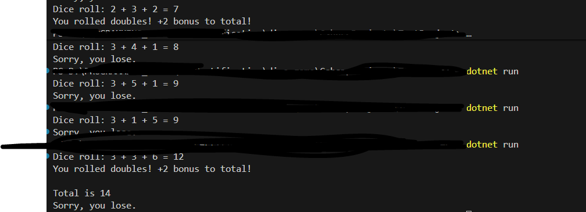

# dice-game

A simple console-based dice game built using C# and .NET.

Rules
- If any two dice you roll result in the same value, you get two bonus points for rolling doubles.
- If all three dice you roll result in the same value, you get six bonus points for rolling triples.
- If the sum of the three dice rolls, plus any point bonuses, is 15 or greater, you win the game. Otherwise, you lose.

